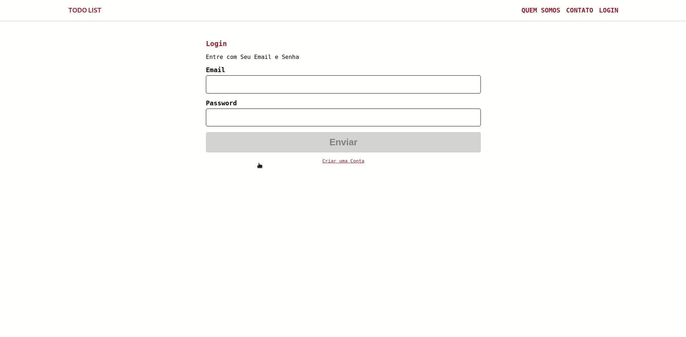
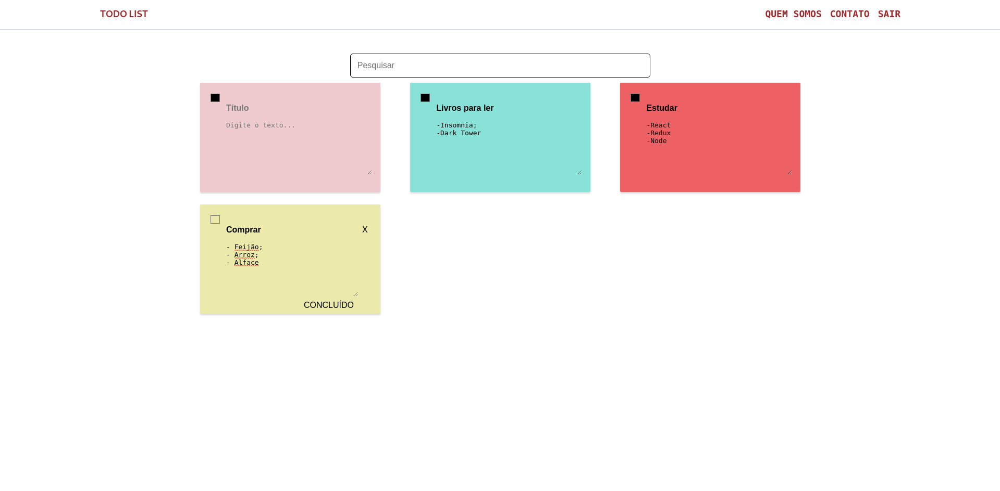

## TODO LIST

https://todo-list-leticia-soares.netlify.app/

<b>Commands:</b>

- npm start - start the application

- npm test - Run the all local test in application

- npm run build - Prepare application to deploy

- npm run storybook - You can see the storybook of project by port 6006

<b>Used technologies:</b>

- React - A JavaScript library for building user interfaces

- Styled-components - We could enhance CSS for styling React component systems

- Storybook - Storybook for developing UI components

- Redux - A predictable state container for JavaScript apps.

- Redux Saga - A library that aims to make application side effects (i.e. asynchronous things like data fetching and impure things like accessing the browser cache) easier to manage, more efficient to execute, easy to test, and better at handling failures.

- Jest - A delightful JavaScript Testing Framework with a focus on simplicity

- Enzyme - A JavaScript Testing utility for React that makes it easier to test your React Components' output
